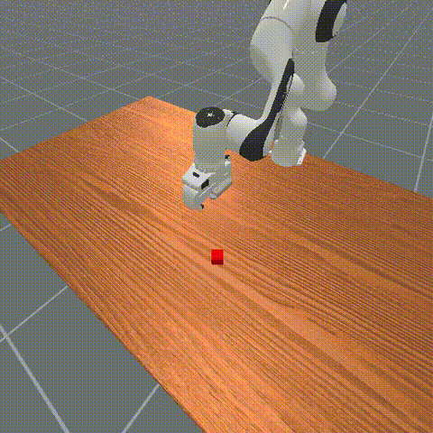
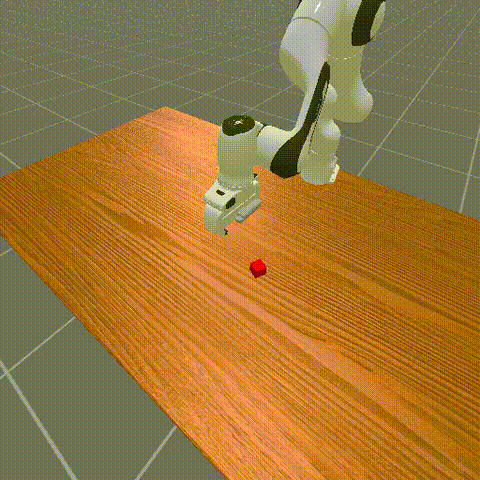
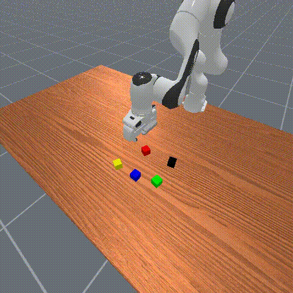
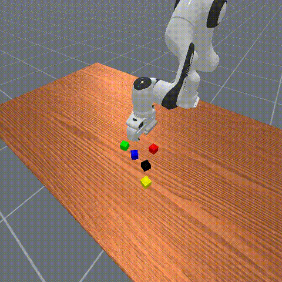
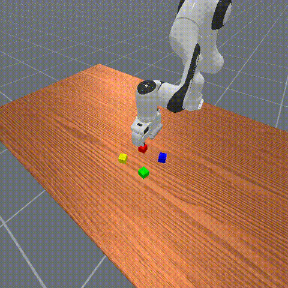

# RobotSim
This repository aims to evaluate SmolVLA within a simulated environment, specifically using the ManiSkill platform to perform a series of manipulation tasks with a Franka robotic arm.

## Installation
Creating the environment by following the instructions in [LeRobot](https://github.com/huggingface/lerobot).

## Evaluating Models
There are several envs can be tested. e.g., to test in 5 cubes env, run:
```
cd RobotSim
python -m ManiSkill.EvalTasks.LiftCube_5colour
```

## Results
### Testing in env with one cube
*Successful example*



*Failed example*



### Testing in env with five cubes
*Successful example*



*Failed example(miss but contact)*



*Failed example(fail to determine the correct colour)*


